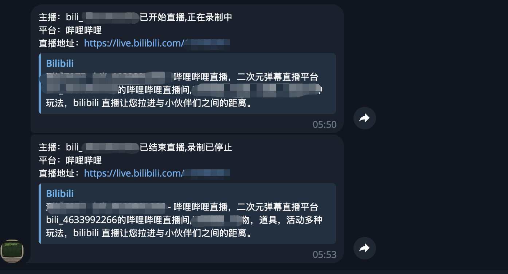
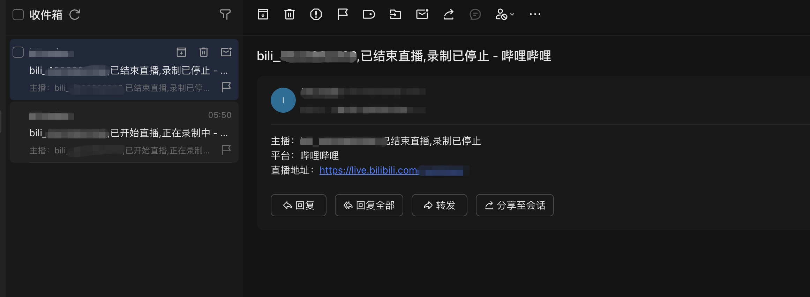

# Notify 通知模块

## 功能说明

该模块提供统一的通知发送功能，支持以下通知方式：
- Telegram 消息通知
- Email 邮件通知
- Ntfy 消息通知

## 使用方法

### 发送telegram通知

https://core.telegram.org/bots#6-botfather

#### 示例展示




### 发送email测试通知(QQ邮箱示例)

https://wx.mail.qq.com/list/readtemplate?name=app_intro.html#/agreement/authorizationCode


#### 示例展示



### 发送ntfy通知

ntfy是一个开源的推送通知服务，您可以使用公共服务器 https://ntfy.sh 或者搭建自己的ntfy服务器。

#### 配置说明

在配置文件中启用ntfy通知服务：

```yaml
# 通知服务配置
notify:
  telegram:
    enable: true                # 是否启用Telegram通知
    withNotification: true      # 是否在Telegram通知中包含通知内容（是否有声音通知）
    botToken: "YOUR_BOT_TOKEN"  # Telegram机器人的Token
    chatID: "YOUR_CHAT_ID"      # 接收通知的Chat ID
  
  email:
    enable: true                # 是否启用邮件通知
    smtpHost: "smtp.example.com" # SMTP服务器地址
    smtpPort: 465               # SMTP服务器端口
    senderEmail: "sender@example.com"    # 发送者邮箱
    senderPassword: "password"  # 发送者邮箱密码或授权码
    recipientEmail: "recipient@example.com"  # 接收者邮箱
    
  ntfy:
    enable: true                # 是否启用ntfy通知
    URL: "https://ntfy.sh/your-topic"  # ntfy服务器地址和主题
    token: "your-token"         # 如果需要认证，填写访问令牌
    tag: "notes"                # 消息标签
```

#### scheme_config.ini配置

为了支持"打开直播间"功能，您需要在项目根目录的`scheme_config.ini`文件中添加主播名称与应用协议URL的映射关系：

```ini
主播名称,应用协议URL
示例主播,snssdk2329://live?room_id=123456789
```

## 注意事项

1. 请确保在使用通知功能前已正确配置相关参数
2. 函数会自动检测启用的通知方式并发送，如果某种通知方式发送失败，不会影响其他通知方式的发送
3. 邮件通知使用SMTP协议发送，请确保SMTP服务器配置正确
4. ntfy通知需要可访问的ntfy服务器，可以使用公共服务器或自建服务器